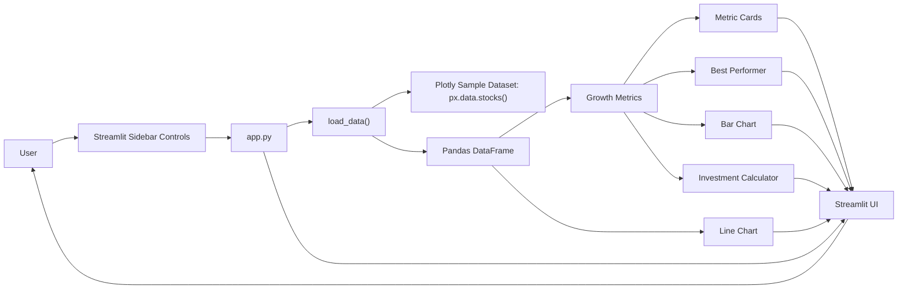

# Stock Explorer

`Stock Explorer` is a small Streamlit app for comparing normalized stock performance using Plotly's built-in sample dataset. It lets you select stocks, review relative growth, compare top performers, and estimate how a hypothetical investment would have changed over the sample period.

## Features

- Multi-select stock comparison from the sidebar
- KPI cards for selected stocks
- Best-performer summary
- Line chart for normalized price movement
- Bar chart for total percentage growth
- Simple investment outcome calculator

## Architecture



## Tech Stack

- Python
- Streamlit
- Pandas
- Plotly

## Run Locally

1. Install dependencies:

```bash
pip install -r requirements.txt
```

2. Start the app:

```bash
streamlit run app.py
```

## Notes

- The app uses Plotly's normalized sample stock dataset, not live market data.
- Values are indexed to `1.00` at the start of the sample period, so the charts show relative growth rather than raw prices.

## Reflection
The Playwright MCP helped the most because it let me verify the live app directly instead of relying on assumptions about the deployed UI.
It was especially useful for checking what actually rendered in the browser and producing a screenshot as evidence.
One thing that surprised me was that the Streamlit page loaded with the hosting shell and page title, but the expected app content did not appear.
That made the browser snapshot more valuable than a simple visual check, because it exposed the real loaded state of the page.

